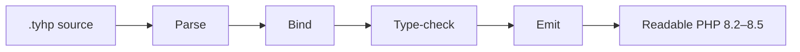

<p align="center">
  
</p>

<h1 align="center">Tyhp</h1>

<p align="center">
  <strong>A strongly typed superset of PHP.</strong><br>
</p>

<p align="center">
  <a href="https://tyhplang.com"><strong>Documentation</strong></a>
  ·
  <a href="https://github.com/tyhpproject/tyhp/releases"><strong>Releases</strong></a>
  ·
  <a href="#quick-start"><strong>Quick start</strong></a>
  ·
  <a href="CONTRIBUTING.md"><strong>Contributing</strong></a>
</p>

<p align="center">
  <a href="https://tyhplang.com"></a>
  <a href="https://www.php.net"></a>
  <a href="LICENSE.txt"></a>
  <a href="https://github.com/tyhpproject/tyhp/releases"></a>
</p>

---

PHP is one of the web's most established runtimes, backed by a vast ecosystem and a deployment story teams already understand. Tyhp builds on that foundation with a **real type system** — required types, null safety, generics, structs, `async`/`await`, extension methods, and expression trees — then emits readable PHP 8.2–8.5.

**Compile with Tyhp. Deploy with PHP.** Keep your Composer packages, existing infrastructure, and familiar runtime.

> **Public alpha (`805.0.0-alpha.1`).** The compiler, type checker, emitter, and CLI work today. Language Server, sourcemaps, and the VS Code extension are still ahead. Syntax may still change.

## Write this. Ship PHP.

One `.tyhp` file in. The compiler type-checks it, erases the Tyhp-only surface, and writes ordinary PHP — one file per class. This is the **actual emit** from `tyhp build` for the sample below.

**Tyhp**

```php
<?tyhp
namespace App;

type UserId = int;

struct Address {
    string $city;
    string $country;
}

class User {
    public function __construct(
        public readonly UserId $id,
        public string $name,
        public int $age,
        public Address $address,
        public bool $isActive = true,
    ): void {}
}

class UserQuery {
    public function where(\Tyhp\Expression<User, bool> $pred): static {
        // The lambda is captured as an expression tree — SQL, not a closure.
        return $this;
    }

    public function orderBy(\Tyhp\PropertyPath<User, string> $path): static {
        return $this;
    }

    public async function toArray(): array<User> {
        return [];
    }
}

async function loadAdults(UserQuery $users): array<User> {
    UserQuery $filtered = $users->where(fn ($u) => $u->age >= 18 && $u->isActive);
    UserQuery $ordered = $filtered->orderBy(fn ($u) => $u->name);
    return await $ordered->toArray();
}
```

<details>
<summary>Emitted PHP from <code>tyhp build</code> — <code>UserId</code> → <code>int</code>, <code>Address</code> struct → <code>array</code>, <code>async</code> → <code>Promise</code>, <code>fn</code> lambdas → data</summary>

<br>

`build/App/User.php`

```php
<?php

/**
 * Generated by Tyhp compiler.
 */

declare(strict_types=1);

namespace App;

class User
{
    public function __construct(public readonly int $id, public string $name, public int $age, public array $address, public bool $isActive = true)
    {
    }
}
```

`build/App/UserQuery.php`

```php
<?php

/**
 * Generated by Tyhp compiler.
 */

declare(strict_types=1);

namespace App;

class UserQuery
{
    public function where(\Tyhp\Expression $pred): static
    {
        return $this;
    }
    public function orderBy(\Tyhp\PropertyPath $path): static
    {
        return $this;
    }
    public function toArray(): \Tyhp\Promise
    {
        return \Tyhp\Promise::_async(function (): array {
            return [];
        });
    }
}
```

`build/App/_functions.php`

```php
<?php

/**
 * Generated by Tyhp compiler.
 */

declare(strict_types=1);

namespace App;

function loadAdults(\App\UserQuery $users): \Tyhp\Promise
{
    return \Tyhp\Promise::_async(function () use ($users): array {
        $filtered = $users->where(new \Tyhp\Expression(body: new \Tyhp\Expression\BinaryExpression(new \Tyhp\Expression\BinaryExpression(new \Tyhp\Expression\PropertyAccessExpression(new \Tyhp\Expression\ParameterExpression('u', \App\User::class, 0), 'age', 'int'), '>=', new \Tyhp\Expression\ConstantExpression(18, '18'), 'bool'), '&&', new \Tyhp\Expression\PropertyAccessExpression(new \Tyhp\Expression\ParameterExpression('u', \App\User::class, 0), 'isActive', 'bool'), 'bool'), parameters: [new \Tyhp\Expression\ParameterExpression('u', \App\User::class, 0)], callable: fn(\App\User $u): bool => ($u->age >= 18) && $u->isActive, returnType: 'bool'));
        $ordered = $filtered->orderBy(new \Tyhp\PropertyPath(\App\User::class, 'string', ['name'], fn(\App\User $u): string => $u->name));
        return \Tyhp\Promise::_await($ordered->toArray());
    });
}
```

</details>

That `fn ($u) => $u->age >= 18` is not “just a closure.” When the parameter is `\Tyhp\Expression<…>` or `\Tyhp\PropertyPath<…>`, Tyhp **captures the tree** — the same idea that powers C# LINQ — so query builders and ORMs can see *what you wrote*, not only *what it returns*.

## Why Tyhp

**It is still PHP.** The compiler type-checks `.tyhp`, then emits human-readable `.php`. Deploy anywhere PHP already runs. Mix `.tyhp` and `.php` in one project. Describe existing PHP libraries with `.tyhpdef` files.

**The type system is the language, not a linter plugin.** Every variable, parameter, property, and return is typed or inferred. Types are **non-nullable by default**. `mixed` has to be narrowed before you use it.

**The features PHP has been reaching for.** Generics with type erasure. Structs that compile to arrays. `async`/`await` on Fibers. Operator overloads. Extension methods. Deterministic `using` / `:=` disposal. Compile-time `nameof`, `typeof`, and `default`.



## A type system that means it

```php
<?tyhp
namespace App;

string $name = 'Ada';
$count = 42;                       // inferred as int — and stays int
?string $nickname = null;          // null is opt-in
array<string> $names = ['Ada', 'Grace'];

function label(mixed $value): string {
    if ($value is string) {
        return \strtoupper($value); // narrowed — no cast
    }
    return '';
}
```

Tyhp's extra type syntax is erased after the checker proves the program is safe.

<details>
<summary>Emitted PHP from <code>tyhp build</code> — <code>$value is string</code> → <code>\Tyhp\Type::is</code></summary>

<br>

`build/App/_functions.php`

```php
<?php

/**
 * Generated by Tyhp compiler.
 */

declare(strict_types=1);

namespace App;

function label(mixed $value): string
{
    if (\Tyhp\Type::is($value, \Tyhp\Type::string())) {
        return \strtoupper($value);
    }
    return '';
}
```

`build/typesystem.php`

```php
<?php

/**
 * Generated by Tyhp compiler.
 */

declare(strict_types=1);

namespace App;
require_once __DIR__ . '/vendor/autoload.php';

$name = 'Ada';

$count = 42;

$nickname = null;

$names = ['Ada', 'Grace'];
```

</details>

## Language that feels modern

**Generics** — write reusable classes that preserve specific types from construction through every method call:

```php
<?tyhp
namespace App;

class Box<T> {
    public function __construct(private T $value): void {}
    public fn getValue(): T => $this->value;
}

Box<int> $box = new Box<int>(42);
int $value = $box->getValue();     // checked as int, never mixed
```

The compiler checks `T` end to end, then erases it from the PHP output.

<details>
<summary>Emitted PHP from <code>tyhp build</code> — generic type arguments erased after checking</summary>

<br>

`build/App/Box.php`

```php
<?php

/**
 * Generated by Tyhp compiler.
 */

declare(strict_types=1);

namespace App;

class Box
{
    public function __construct(private mixed $value)
    {
    }
    public function getValue(): mixed
    {
        return $this->value;
    }
}
```

`build/generics.php`

```php
<?php

/**
 * Generated by Tyhp compiler.
 */

declare(strict_types=1);

namespace App;
require_once __DIR__ . '/vendor/autoload.php';

$box = new Box(42);

$value = $box->getValue();
```

</details>

**Structs** — named, typed data that compiles to associative arrays:

```php
<?tyhp
namespace App;

struct Point {
    float $x;
    float $y;
}

Point $p = new Point() with [x => 10.5, y => 20.3];
Point $moved = clone $p with [x => 5.0];
```

<details>
<summary>Emitted PHP from <code>tyhp build</code> — struct gone, <code>with</code> → <code>array_replace</code></summary>

<br>

`build/structs.php`

```php
<?php

/**
 * Generated by Tyhp compiler.
 */

declare(strict_types=1);

namespace App;
require_once __DIR__ . '/vendor/autoload.php';

$p = ['x' => 10.5, 'y' => 20.3];

$moved = \array_replace($p, ['x' => 5.0]);
```

</details>

**Async / await** — write sequential code, run on PHP Fibers via `tyhp/async`:

```php
<?tyhp
namespace App;

class User {
}

class UserRepo {
    public async function find(int $id): User {
        return new User();
    }
}

async function fetchUser(UserRepo $repo, int $id): User {
    return await $repo->find($id);
}

async function fetchAll(
    \Tyhp\Promise<User> $a,
    \Tyhp\Promise<User> $b,
    \Tyhp\Promise<User> $c,
): array<User> {
    return await \Tyhp\Promise::all([$a, $b, $c]);
}
```

<details>
<summary>Emitted PHP from <code>tyhp build</code> — <code>async</code>/<code>await</code> → <code>Promise::_async</code> / <code>Promise::_await</code></summary>

<br>

`build/App/User.php`

```php
<?php

/**
 * Generated by Tyhp compiler.
 */

declare(strict_types=1);

namespace App;

class User
{
}
```

`build/App/UserRepo.php`

```php
<?php

/**
 * Generated by Tyhp compiler.
 */

declare(strict_types=1);

namespace App;

class UserRepo
{
    public function find(int $id): \Tyhp\Promise
    {
        return \Tyhp\Promise::_async(function () use ($id): \App\User {
            return new User();
        });
    }
}
```

`build/App/_functions.php`

```php
<?php

/**
 * Generated by Tyhp compiler.
 */

declare(strict_types=1);

namespace App;

function fetchUser(\App\UserRepo $repo, int $id): \Tyhp\Promise
{
    return \Tyhp\Promise::_async(function () use ($repo, $id): \App\User {
        return \Tyhp\Promise::_await($repo->find($id));
    });
}

function fetchAll(\Tyhp\Promise $a, \Tyhp\Promise $b, \Tyhp\Promise $c): \Tyhp\Promise
{
    return \Tyhp\Promise::_async(function () use ($a, $b, $c): array {
        return \Tyhp\Promise::_await(\Tyhp\Promise::all([$a, $b, $c]));
    });
}
```

</details>

**Extensions and disposal** — add methods to types you do not own, and close resources at scope exit:

```php
<?tyhp
namespace App;

class DatabaseConnection implements \Tyhp\Contracts\IsDisposable {
    public function __construct(string $dsn): void {}
    public function dispose(): void {}
}

extension Strings {
    function toCamelCase(extends string $this): string {
        return $this;
    }
}

function demo(string $dsn): string {
    string $slug = 'hello_world';
    string $title = $slug->toCamelCase();
    $conn := new DatabaseConnection($dsn);
    return $title;
}
```

<details>
<summary>Emitted PHP from <code>tyhp build</code> — extension call → static call, <code>:=</code> → <code>DisposableScope</code></summary>

<br>

`build/App/Strings.php`

```php
<?php

/**
 * Generated by Tyhp compiler.
 */

declare(strict_types=1);

namespace App;

class Strings
{
    public static function toCamelCase(string $this_): string
    {
        return $this_;
    }
}
```

`build/App/DatabaseConnection.php`

```php
<?php

/**
 * Generated by Tyhp compiler.
 */

declare(strict_types=1);

namespace App;

class DatabaseConnection implements \Tyhp\Contracts\IsDisposable
{
    public function __construct(string $dsn)
    {
    }
    public function dispose(): void
    {
    }
}
```

`build/App/_functions.php`

```php
<?php

/**
 * Generated by Tyhp compiler.
 */

declare(strict_types=1);

namespace App;

function demo(string $dsn): string
{
    $__scope_0 = \Tyhp\DisposableScope::create();
    $slug = 'hello_world';
    $title = \App\Strings::toCamelCase($slug);
    $conn = $__scope_0->using(new DatabaseConnection($dsn));
    return $title;
}
```

</details>

| You write | What you get |
| --- | --- |
| Generics, type aliases, literal unions | Compile-time safety, erased from PHP |
| Structs + `with` | Array-backed data with a schema |
| `async` / `await` | `Promise<T>` on Fibers |
| Parsable lambdas | Expression trees and property paths |
| Extension methods & operator overloads | Static calls in the emitted PHP |
| `using` / `:=` | Deterministic resource cleanup |
| `.tyhpdef` files | Typed interop with existing PHP |

Full syntax: the [quick reference](https://tyhplang.com/quickref.html) and [`docs/content/quickref.md`](docs/content/quickref.md).

## Install the compiler

Download a binary from [GitHub Releases](https://github.com/tyhpproject/tyhp/releases), or:

```bash
curl -fsSL https://raw.githubusercontent.com/tyhpproject/tyhp/main/scripts/install.sh | bash -s --
```

The script picks OS/arch and prefers a self-contained build (no .NET install). Pass `--framework-dependent` if you already have [.NET 9](https://dotnet.microsoft.com/en-us/download/dotnet/9.0). On Windows, use [`scripts/install.ps1`](scripts/install.ps1).

Verify with `tyhp version`. There is no `composer global require tyhp/compiler` package in this alpha.

**To run compiled output** you need PHP 8.2+ and Composer. **To compile**, you need the Tyhp binary — deployment servers never do.

## Quick start

```bash
mkdir my-tyhp-project && cd my-tyhp-project
tyhp init
tyhp build
php build/index.php
```

`tyhp init` writes `tyhp.json`, `src/index.tyhp`, and a `composer.json` that pins `tyhp/php` and `tyhp/core`. `tyhp build` emits PHP under `build/`. `tyhp lint` type-checks without emitting.

After Packagist is live:

```bash
composer install
```

Until then, clone this repository and let the compiler inject **path repositories** that point at `runtime/packages/` in the checkout.

## Runtime packages

| Package | Role |
| --- | --- |
| [`tyhp/php`](https://github.com/tyhpproject/php) | Type definitions for PHP builtins (PHP 8.2 baseline) |
| [`tyhp/core`](https://github.com/tyhpproject/core) | Runtime support (generics, typed variables, property accessors) |
| [`tyhp/async`](https://github.com/tyhpproject/async) | Promise, event loop, cancellation |
| [`tyhp/decimal`](https://github.com/tyhpproject/decimal) | Arbitrary-precision decimal |
| [`tyhp/lambda`](https://github.com/tyhpproject/lambda) | Expression-tree / PropertyPath runtime |

## What ships in this alpha

Done through roadmap **Tier 1** (stories 01–16.5): parser, binder, checker, emitter, `tyhp build` / `tyhp lint` / `tyhp init`, diagnostics, the PHP interop contract, parsable lambdas, and callable signature utilities.

<details>
<summary>Not in this alpha</summary>

<br>

Language Server / VS Code extension, sourcemaps, Xdebug proxy, tyhpdef generator CLI, optimizer, <code>internal</code>, web playground, and a complete PHP-stub catalog. See the <a href="https://tyhplang.com">docs</a> for the full roadmap.

</details>

## Documentation & community

- Site: [https://tyhplang.com](https://tyhplang.com)
- Docs source: [`docs/content/`](docs/content/)
- Versioning: [`VERSIONING.md`](VERSIONING.md)
- Contributing: [`CONTRIBUTING.md`](CONTRIBUTING.md)
- License: [Apache License 2.0](LICENSE.txt)
- Alpha release checklist (maintainers): [`dev-docs/ALPHA_RELEASE.md`](dev-docs/ALPHA_RELEASE.md)

Issues and pull requests are welcome.
