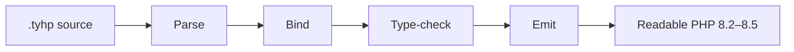

<p align="center">
  
</p>
<p align="center">
  <strong>A typed superset of the PHP language.</strong><br>
</p>

<p align="center">
  <a href="https://tyhplang.com"><strong>Documentation</strong></a>
  ·
  <a href="https://github.com/tyhpproject/tyhp/releases"><strong>Releases</strong></a>
  ·
  <a href="#quick-start"><strong>Quick start</strong></a>
  ·
  <a href="CONTRIBUTING.md"><strong>Contributing</strong></a>
</p>

<p align="center">
  <a href="https://tyhplang.com"></a>
  <a href="https://www.php.net"></a>
  <a href="LICENSE.txt"></a>
  <a href="https://github.com/tyhpproject/tyhp/releases"></a>
</p>

---

Tyhp is a typed superset of the PHP language. You write `.tyhp` (and can keep `.php` in the same project). The compiler type-checks the Tyhp source and emits readable PHP 8.2–8.5.

**Compile with Tyhp. Deploy with PHP.** Required types, null safety, generics, structs, `async`/`await`, extension methods, and expression trees are part of Tyhp; the output is ordinary PHP that runs on a PHP runtime. Composer packages and existing hosting stay in the picture.

> **Public beta (`805.1.0-beta.1`).** The compiler, type checker, emitter, and CLI work today. Syntax may still change.

## Write this. Ship PHP.

One `.tyhp` file in. The compiler type-checks it, erases the Tyhp-only surface, and writes ordinary PHP — one file per class. This is the **actual emit** from `tyhp build` for the sample below.

**Tyhp**

```php
<?tyhp
namespace App;

type UserId = int;

type Address = struct {
    string $city;
    string $country;
};

class User {
    public function __construct(
        public readonly UserId $id,
        public string $name,
        public int $age,
        public Address $address,
        public bool $isActive = true,
    ): void {}
}

class UserQuery {
    public function where(\Tyhp\Expression<callable(User): bool> $pred): static {
        // The lambda is captured as an expression tree — SQL, not a closure.
        return $this;
    }

    public function orderBy(\Tyhp\PropertyPath<callable(User): string> $path): static {
        return $this;
    }

    public async function toArray(): array<User> {
        return [];
    }
}

async function loadAdults(UserQuery $users): array<User> {
    UserQuery $filtered = $users->where(fn ($u) => $u->age >= 18 && $u->isActive);
    UserQuery $ordered = $filtered->orderBy(fn ($u) => $u->name);
    return await $ordered->toArray();
}
```

<details>
<summary>Emitted PHP from <code>tyhp build</code> — <code>UserId</code> → <code>int</code>, <code>Address</code> struct → <code>array</code>, <code>async</code> → <code>Promise</code>, <code>fn</code> lambdas → data</summary>

<br>

`build/App/User.php`

```php
<?php

/**
 * Generated by Tyhp compiler.
 */

declare(strict_types=1);

namespace App;

class User
{
    public function __construct(public readonly int $id, public string $name, public int $age, public array $address, public bool $isActive = true)
    {
    }
}
```

`build/App/UserQuery.php`

```php
<?php

/**
 * Generated by Tyhp compiler.
 */

declare(strict_types=1);

namespace App;

class UserQuery
{
    public function where(\Tyhp\Expression $pred): static
    {
        return $this;
    }
    public function orderBy(\Tyhp\PropertyPath $path): static
    {
        return $this;
    }
    public function toArray(): \Tyhp\Promise
    {
        return \Tyhp\Promise::_async(function (): array {
            return [];
        });
    }
}
```

`build/App/_functions.php`

```php
<?php

/**
 * Generated by Tyhp compiler.
 */

declare(strict_types=1);

namespace App;

function loadAdults(\App\UserQuery $users): \Tyhp\Promise
{
    return \Tyhp\Promise::_async(function () use ($users): array {
        $filtered = $users->where(new \Tyhp\Expression(body: new \Tyhp\Expression\BinaryExpression(new \Tyhp\Expression\BinaryExpression(new \Tyhp\Expression\PropertyAccessExpression(new \Tyhp\Expression\ParameterExpression('u', \App\User::class, 0), 'age', 'int'), '>=', new \Tyhp\Expression\ConstantExpression(18, '18'), 'bool'), '&&', new \Tyhp\Expression\PropertyAccessExpression(new \Tyhp\Expression\ParameterExpression('u', \App\User::class, 0), 'isActive', 'bool'), 'bool'), parameters: [new \Tyhp\Expression\ParameterExpression('u', \App\User::class, 0)], callable: fn(\App\User $u): bool => ($u->age >= 18) && $u->isActive, returnType: 'bool'));
        $ordered = $filtered->orderBy(new \Tyhp\PropertyPath(\App\User::class, 'string', ['name'], fn(\App\User $u): string => $u->name));
        return \Tyhp\Promise::_await($ordered->toArray());
    });
}
```

</details>

When the parameter is `\Tyhp\Expression<…>` or `\Tyhp\PropertyPath<…>`, that `fn ($u) => $u->age >= 18` is captured as an expression tree, not only compiled as a closure. Query builders can inspect the tree.

## Why Tyhp

**It compiles to PHP.** The compiler type-checks `.tyhp`, then emits human-readable `.php`. Deploy on a PHP runtime. Mix `.tyhp` and `.php` in one project. Describe existing PHP libraries with `.tyhpdef` files.

**Types are part of the language.** Every variable, parameter, property, and return is typed or inferred. Types are **non-nullable by default**. `mixed` has to be narrowed before you use it.

**Extra syntax on top of PHP.** Generics with type erasure. Structs that compile to arrays. `async`/`await` on Fibers. Operator overloads. Extension methods. Deterministic `using` / `:=` disposal. Compile-time `nameof`, `typeof`, and `default`.


```mermaid
flowchart LR
  A[".tyhp source"] --> B[Parse]
  B --> C[Bind]
  C --> D[Type-check]
  D --> E[Emit]
  E --> F["Readable PHP 8.2–8.5"]
```

## Required types

```php
<?tyhp
namespace App;

$sum = 0;                          // inferred as int
$name = 'Ada';                     // inferred as string
?string $nickname = null;          // explicit when inference is not enough
array<string> $names = ['Ada', 'Grace'];

function label(mixed $value): string {
    if ($value is string) {
        return \strtoupper($value); // narrowed — no cast
    }
    return '';
}
```

Tyhp's extra type syntax is erased after the checker accepts the program.

<details>
<summary>Emitted PHP from <code>tyhp build</code> — <code>$value is string</code> → <code>\is_string($value)</code></summary>

<br>

`build/App/_functions.php`

```php
<?php

/**
 * Generated by Tyhp compiler.
 */

declare(strict_types=1);

namespace App;

function label(mixed $value): string
{
    if (\is_string($value)) {
        return \strtoupper($value);
    }
    return '';
}
```

`build/typesystem.php`

```php
<?php

/**
 * Generated by Tyhp compiler.
 */

declare(strict_types=1);

namespace App;
require_once __DIR__ . '/vendor/autoload.php';

$sum = 0;

$name = 'Ada';

$nickname = null;

$names = ['Ada', 'Grace'];
```

</details>

## What Tyhp adds

**Generics** — write reusable classes that preserve specific types from construction through every method call:

```php
<?tyhp
namespace App;

#[\Tyhp\EraseGeneric]
class Box<T> {
    public function __construct(private T $value): void {}
    public fn getValue(): T => $this->value;
}

Box<int> $box = new Box<int>(42);
int $value = $box->getValue();     // checked as int, never mixed
```

`#[\Tyhp\EraseGeneric]` opts this `Box` out of runtime tracking, so the PHP is a normal class. Without it, a generic-typed property like `$value` keeps tracking (`HasGenerics` / factories) even with no `typeof(T)` or other runtime use. Compiled-library call sites use `\Tyhp\Generic::bind`.

<details>
<summary>Emitted PHP from <code>tyhp build</code> — <code>#[\Tyhp\EraseGeneric]</code> keeps this <code>Box</code> untracked, so PHP is a normal class</summary>

<br>

`build/App/Box.php`

```php
<?php

/**
 * Generated by Tyhp compiler.
 */

declare(strict_types=1);

namespace App;

/**
 * @template T
 */
#[\Tyhp\GenericRuntime(erased: true, layouts: [1], compiler: "805.1.0.0")]
class Box
{
    public function __construct(private mixed $value)
    {
    }
    public function getValue(): mixed
    {
        return $this->value;
    }
}
```

Every emitted generic class is stamped `#[\Tyhp\GenericRuntime]` — even this erased one — so foreign compiled-library call sites always have something to route through `\Tyhp\Generic::bind`.

`build/generics.php`

```php
<?php

/**
 * Generated by Tyhp compiler.
 */

declare(strict_types=1);

namespace App;
require_once __DIR__ . '/vendor/autoload.php';

$box = new Box(42);

$value = $box->getValue();
```

</details>

**Structs** — named, typed data that compiles to associative arrays:

```php
<?tyhp
namespace App;

type Point = struct {
    float $x;
    float $y;
};

Point $p = new Point() with [x => 10.5, y => 20.3];
Point $moved = clone $p with [x => 5.0];
```

<details>
<summary>Emitted PHP from <code>tyhp build</code> — struct gone, <code>with</code> → <code>array_replace</code></summary>

<br>

`build/structs.php`

```php
<?php

/**
 * Generated by Tyhp compiler.
 */

declare(strict_types=1);

namespace App;
require_once __DIR__ . '/vendor/autoload.php';

$p = ['x' => 10.5, 'y' => 20.3];

$moved = \array_replace($p, ['x' => 5.0]);
```

</details>

**Async / await** — write sequential code, run on PHP Fibers via `tyhp/async`:

```php
<?tyhp
namespace App;

class User {
}

class UserRepo {
    public async function find(int $id): User {
        return new User();
    }
}

async function fetchUser(UserRepo $repo, int $id): User {
    return await $repo->find($id);
}

async function fetchAll(
    \Tyhp\Promise<User> $a,
    \Tyhp\Promise<User> $b,
    \Tyhp\Promise<User> $c,
): array<User> {
    return await \Tyhp\Promise::all([$a, $b, $c]);
}
```

<details>
<summary>Emitted PHP from <code>tyhp build</code> — <code>async</code>/<code>await</code> → <code>Promise::_async</code> / <code>Promise::_await</code></summary>

<br>

`build/App/User.php`

```php
<?php

/**
 * Generated by Tyhp compiler.
 */

declare(strict_types=1);

namespace App;

class User
{
}
```

`build/App/UserRepo.php`

```php
<?php

/**
 * Generated by Tyhp compiler.
 */

declare(strict_types=1);

namespace App;

class UserRepo
{
    public function find(int $id): \Tyhp\Promise
    {
        return \Tyhp\Promise::_async(function () use ($id): \App\User {
            return new User();
        });
    }
}
```

`build/App/_functions.php`

```php
<?php

/**
 * Generated by Tyhp compiler.
 */

declare(strict_types=1);

namespace App;

function fetchUser(\App\UserRepo $repo, int $id): \Tyhp\Promise
{
    return \Tyhp\Promise::_async(function () use ($repo, $id): \App\User {
        return \Tyhp\Promise::_await($repo->find($id));
    });
}

function fetchAll(\Tyhp\Promise $a, \Tyhp\Promise $b, \Tyhp\Promise $c): \Tyhp\Promise
{
    return \Tyhp\Promise::_async(function () use ($a, $b, $c): array {
        return \Tyhp\Promise::_await(\Tyhp\Promise::all([$a, $b, $c]));
    });
}
```

</details>

**Extensions and disposal** — add methods to types you do not own, and close resources at scope exit:

```php
<?tyhp
namespace App;

class DatabaseConnection implements \Tyhp\Contracts\IsDisposable {
    public function __construct(string $dsn): void {}
    public function dispose(): void {}
}

extension Strings extends string {
    function toCamelCase(): string {
        return $this;
    }
}

function demo(string $dsn): string {
    string $slug = 'hello_world';
    string $title = $slug->toCamelCase();
    $conn := new DatabaseConnection($dsn);
    return $title;
}
```

<details>
<summary>Emitted PHP from <code>tyhp build</code> — extension call → static call, <code>:=</code> → <code>DisposableScope</code></summary>

<br>

`build/App/Strings.php`

```php
<?php

/**
 * Generated by Tyhp compiler.
 */

declare(strict_types=1);

namespace App;

class Strings
{
    public static function toCamelCase(string $this_): string
    {
        return $this_;
    }
}
```

`build/App/DatabaseConnection.php`

```php
<?php

/**
 * Generated by Tyhp compiler.
 */

declare(strict_types=1);

namespace App;

class DatabaseConnection implements \Tyhp\Contracts\IsDisposable
{
    public function __construct(string $dsn)
    {
    }
    public function dispose(): void
    {
    }
}
```

`build/App/_functions.php`

```php
<?php

/**
 * Generated by Tyhp compiler.
 */

declare(strict_types=1);

namespace App;

function demo(string $dsn): string
{
    $__scope_0 = \Tyhp\DisposableScope::create();
    $slug = 'hello_world';
    $title = \App\Strings::toCamelCase($slug);
    $conn = $__scope_0->using(new DatabaseConnection($dsn));
    return $title;
}
```

</details>

| You write | What you get |
| --- | --- |
| Generics, type aliases, literal unions | Compile-time checks; PHP is a normal class/function unless `T` is tracked |
| Structs + `with` | PHP `array`; no runtime shape check |
| `async` / `await` | `Promise::_async` / `_await` on Fibers |
| Parsable lambdas | Expression trees and property paths |
| Extension methods & operator overloads | Static calls in the emitted PHP |
| `using` / `:=` | Deterministic resource cleanup |
| `.tyhpdef` files | Typed interop with existing PHP |

Full syntax: the [quick reference](https://tyhplang.com/quickref.html).

## Install the compiler

**Composer** (PHP-first): `tyhp/compiler` is a supported install path.

```bash
composer require --dev tyhp/compiler
vendor/bin/tyhp init
composer update
vendor/bin/tyhp build
# or: composer tyhp build
```

`vendor/bin/tyhp --install-binary` downloads the native compiler (the root `post-autoload-dump` script `tyhp init` writes does this for you). Use `composer update`, not `composer install`, after `tyhp init` — the `composer.lock` from `composer require` predates the `tyhpdef/php` / `tyhp/core` packages init just added. Full steps: [Install the compiler](https://tyhplang.com/intro_installation.html).

**GitHub Releases** (native binary on `PATH`):

```bash
curl -fsSL https://raw.githubusercontent.com/tyhpproject/tyhp/main/scripts/install.sh | bash -s --
```

The script picks OS/arch and prefers a self-contained build (no .NET install). Pass `--framework-dependent` if you already have [.NET 9](https://dotnet.microsoft.com/en-us/download/dotnet/9.0). On Windows, use [`scripts/install.ps1`](scripts/install.ps1). Verify with `tyhp version`. If you already have `tyhp` and still need Composer: `tyhp install composer` (writes `./composer.phar` by default; `--global` → `~/.local/bin/composer`). That is not `tyhp composer install`, which runs Composer’s own `install`.

**To run compiled output** you need PHP 8.2+ and Composer. **To compile**, you need the Tyhp binary — deployment servers never do.

## Quick start

```bash
mkdir my-tyhp-project && cd my-tyhp-project
tyhp init
composer install
tyhp build
php build/src/index.php
```

`tyhp init` writes `tyhp.json`, `src/index.tyhp`, and a `composer.json` with `tyhp/core` as `@dev` in `require`, `tyhpdef/php` as `@dev` in `require-dev`, `tyhp/compiler` in `require-dev`, and Composer scripts for `vendor/bin/tyhp`. Init does not run `composer install`. `tyhp build` emits PHP under `build/`. `tyhp lint` type-checks without emitting.

Until Packagist lists the runtime packages, clone [tyhp-runtime-src](https://github.com/tyhpproject/tyhp-runtime-src) beside this checkout (or set `TYHP_RUNTIME_SRC` to that clone). The compiler uses `packages/` there for local path repositories. When a package fails to compile, fix the Tyhp compiler or its tyhpdefs first.

## Runtime packages

| Package | Role |
| --- | --- |
| [`tyhpdef/php`](https://github.com/tyhpproject-packages/php) | Type definitions for PHP builtins (PHP 8.2 baseline) |
| [`tyhp/core`](https://github.com/tyhpproject-packages/core) | Runtime support (generics, typed variables, property accessors) |
| [`tyhp/async`](https://github.com/tyhpproject-packages/async) | Promise, event loop, cancellation |
| [`tyhp/decimal`](https://github.com/tyhpproject-packages/decimal) | Arbitrary-precision decimal |
| [`tyhp/lambda`](https://github.com/tyhpproject-packages/lambda) | Expression-tree / PropertyPath runtime |

## What ships in this beta

Done through roadmap **Tier 2**: parser, binder, checker, emitter, `tyhp build` / `tyhp lint` / `tyhp init`, diagnostics, the PHP interop contract, parsable lambdas, callable signature utilities, sourcemaps, the Xdebug proxy, the language server, [IDE clients](https://github.com/tyhpproject/tyhp-ide-plugin), `tyhp generate_tyhpdef` (including `--php-targets` gated emit), and `package.tyhpdef` on `tyhp build`.

<details>
<summary>Not in this beta</summary>

<br>

Optimizer, web playground, and a complete PHP-stub catalog. See the <a href="https://tyhplang.com">docs</a> for the full roadmap.

</details>

## Documentation & community

- Site: [https://tyhplang.com](https://tyhplang.com)
- Docs source: [tyhp-docs-src](https://github.com/tyhpproject/tyhp-docs-src)
- IDE plugins: [tyhp-ide-plugin](https://github.com/tyhpproject/tyhp-ide-plugin)
- Versioning: [`VERSIONING.md`](VERSIONING.md)
- Contributing: [`CONTRIBUTING.md`](CONTRIBUTING.md)
- License: [Apache License 2.0](LICENSE.txt)
- Branding (names, taglines, marks): [`BRANDING.md`](BRANDING.md)
- Third-party acknowledgments: [`THIRD_PARTY.md`](THIRD_PARTY.md)

## Acknowledgments

PHP is a trademark of the PHP Group. Tyhp is not affiliated with, endorsed, or sponsored by the PHP Group.

Tyhp downloads official PHP Windows builds, StaticPHP (formerly static-php-cli) portable CLIs, and — if those are unavailable — Homebrew bottles, plus community stub corpora for tyhpdef enrichment. Extension generation may also download php.net HTML manuals (PHP Documentation Group) to build doc comments. Those projects remain under their own licenses. Full credits: [`THIRD_PARTY.md`](THIRD_PARTY.md).
